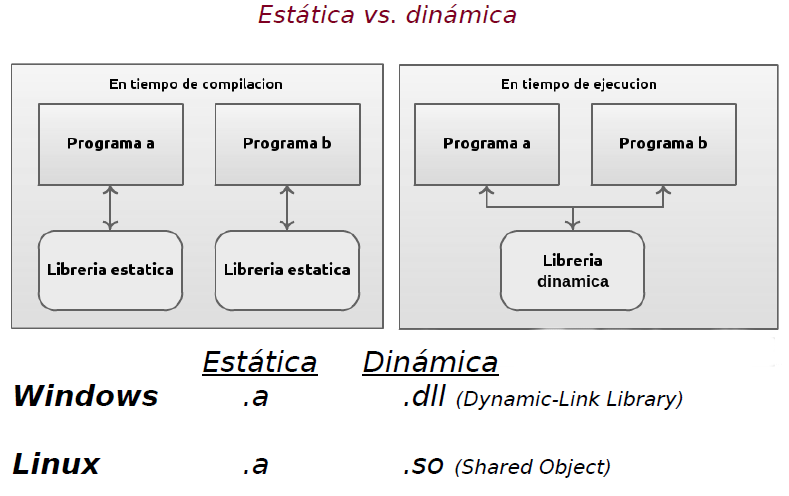
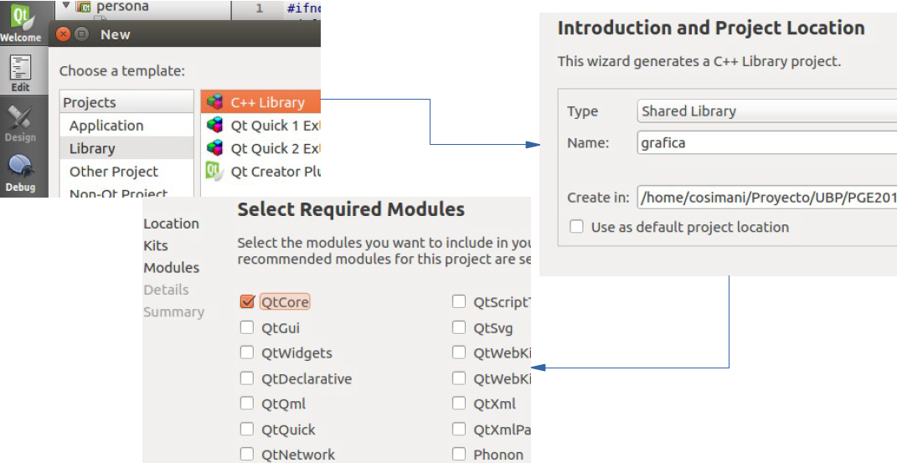
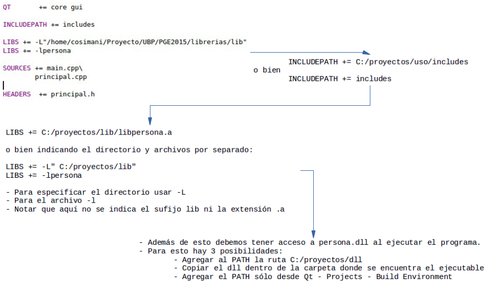

.. -*- coding: utf-8 -*-

.. _rcs_subversion:

Clase 10 - PGE 2022
===================
(Fecha: 15 de septiembre)

Registro en video de algunos temas de la clase de hoy
^^^^^^^^^^^^^^^^^^^^^^^^^^^^^^^^^^^^^^^^^^^^^^^^^^^^^

`QCompleter 2021 <https://youtu.be/0nm8yjuZqPE>`_

`Librerías 2021 <https://youtu.be/dWLr5U8-kDg>`_

Clase QCompleter
================

- Permite completar palabras que está escribiendo el usuario en un QLineEdit
- Se basa en un listado de palabras:

.. code-block::

	QCompleter( const QStringList & list, QObject * parente = nullptr );

.. code-block::

	QStringList lista;
	lista << "Jorge << "Miguel" << "Marcos" << "Luis";

	QCompleter * completer = new QCompleter( lista, this );
	completer->setCaseSensitivity( Qt::CaseInsensitive );
	ui->leUsuario->setCompleter( completer );

Creación y uso de librerías dinámicas
=====================================

.. figure:: images/librerias02.png

Ejercicio 1
===========

- Definir una clase genérica ``MiVector`` que herede de ``QVector< T >`` y que permita ordenar de menor a mayor cualquier elemento.
- Considere que para ordenar de menor a mayor algún elemento se necesitará comparar un elemento con otro.
- Por lo tanto, si deseamos que ``MiVector`` pueda contener elementos de cualquier tipo, y además deseamos ordenarlos, entonces estos elementos deberan cumplir la caraccterística de ser "comparables". Esto es muy familiar cuando se trabaja en Java.
- Definir clases comparables eligiendo la/las característica/s que permitan comparar dichos objetos entre ellos.
- Entre las clases que se pueden definir como comparables están: ``Persona``, ``Poste``, ``Cliente``, ...
- Agregar un método en la clase genérica ``MiVector`` que ordene los elementos. Que el método sea ``void ordenar_de_mayor_a_menor();``
- Probar el funcionamiento del ordenamiento utilizando ``MiVector< Persona >``, ``MiVector< Poste >``, ``MiVector< int >``.
- Mostrar los resultados en un ``QTextEdit`` en lugar de visualizarlo directamente por consola.

Ejercicio 2
===========

- ¿Qué pasaría con el ordenamiento si se utilizan punteros como elementos, por ejemplo, ``MiVector< Persona * >``, ``MiVector< Poste * >``.
- Adaptar para que el ordenamiento se pueda realizar utilizando punteros. Proponer una solución a esto. 

Ejercicio 3
===========

- Utilizar una clase Login creada anteriormente (o crear una nueva) para generar una librería dinámica .dll (en Windows) o .so (en Linux o Mac).
- Login deberá tener caracaterísticas de ser una clase independiente, es decir, que se puedan utilizar en cualquier proyecto sin necesidad de modificarla.

Resolver el desafío correspondiente al Mini Examen 5
====================================================

`Clase ListadoEnteros <https://youtu.be/hwA4Yqcnl7Y>`_ - Código `aquí <https://github.com/cosimani/Curso-PGE-2021/blob/main/desafios/ListadoEnteros.rar?raw=true>`_

`Clase Figura <https://youtu.be/qEZY3__zwFg>`_ - Código `aquí <https://github.com/cosimani/Curso-POO-2021/blob/master/sources/desafios/Figura.rar?raw=true>`_

- Entrar al siguiente `link para ver el registro de los mini exámenes <https://docs.google.com/spreadsheets/d/1Qza70R_ClLLmL0Cmw7cy4F1pwqAMejPwamK9Jmks4ic/edit?usp=sharing>`_ 