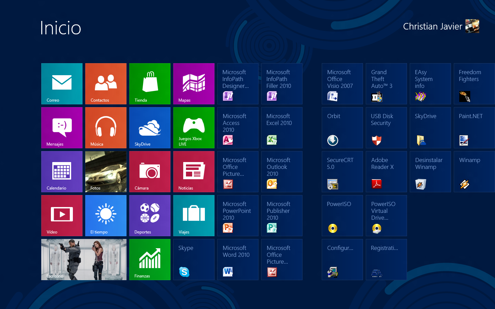

.. -*- coding: utf-8 -*-

.. _rcs_subversion:

Clase 11 - PGE 2022
===================
(Fecha: 20 de septiembre)

Registro en video de algunos temas de la clase de hoy
^^^^^^^^^^^^^^^^^^^^^^^^^^^^^^^^^^^^^^^^^^^^^^^^^^^^^

`QCompleter mejorado 2021 <https://youtu.be/Cv8ANiASdTI>`_

Clase QTreeWidget
=================

- Permite visualizar una vista en árbol
- Maneja ítems (objetos de la clase QTreeWidgetItem)

.. code-block::

    QTreeWidget * treeWidget = new QTreeWidget;
    treeWidget->setColumnCount( 2 );
    QList< QTreeWidgetItem * > items;

    QStringList campos;
    campos << "Campo 1" << "Campo 2";

    for ( int i = 0; i < 5; ++i )
       items.append( new QTreeWidgetItem( campos ) );
 
    treeWidget->addTopLevelItems( items );
    treeWidget->show();

	
Crear un popup para sugerencias (un QCompleter mejorado)
========================================================

.. code-block::

	class Vista : public QWidget  {
	    Q_OBJECT

	public:
	    explicit Vista( QWidget * parent = nullptr );
	    ~Vista();

	private:
	    Ui::Vista * ui;
	    QTreeWidget * popup;
	    QTimer * timer;      
	    QStringList lista;  // La base de datos

	    void crearPopup();
	    bool eventFilter( QObject * obj, QEvent * ev );  // Método virtual de QObject
	    void completarPopup( QVector< QStringList > vector );

	private slots:
	    void slot_sugerencia();
	    void slot_completarLineEdit();
	};

	Vista::Vista( QWidget * parent ) : QWidget( parent ), ui( new Ui::Vista )  {
	    ui->setupUi( this );

	    lista << "julio" << "carlos" << "miguel";
	    this->crearPopup();
	}

	void Vista::crearPopup()  {
	    popup = new QTreeWidget;
	    popup->setColumnCount( 2 );
	    popup->setRootIsDecorated( false );  // Elimina el lugar del ícono de la izquierda.
	    popup->header()->hide();  // Oculta la cabecera
	    popup->installEventFilter( this );

	    connect( popup, SIGNAL( itemClicked( QTreeWidgetItem *, int ) ), SLOT( slot_completarLineEdit() ) );

	    popup->setWindowFlags( Qt::Popup );  // Para que la ventana sea estilo popup
	    timer = new QTimer( this );
	    timer->setSingleShot( true );
	    timer->setInterval( 200 );

	    // Cada 200 mseg busca coincidencias
	    connect( timer, SIGNAL( timeout() ), SLOT( slot_sugerencia() ) );
	    connect( ui->leBuscar, SIGNAL( textEdited( QString ) ), timer, SLOT( start() ) );
	}

	/**
	  * Método virtual de QObject para capturar eventos de teclado y de mouse. Se lo instala
	  * llamando al método installEventFilter(). Si este método devuelve true entonces ninguna
	  * otra implementación de este método en clases derivadas capturará este evento.
	  */
	bool Vista::eventFilter( QObject * obj, QEvent * ev )  {
	    if ( obj == popup )  {
	        if ( ev->type() == QEvent::MouseButtonPress )  {
	            popup->hide();
	            ui->leBuscar->setFocus();
	            return true;
	        }

	        if ( ev->type() == QEvent::KeyPress )  {
	            bool reconocido = false;
	            int key = static_cast< QKeyEvent * >( ev )->key();
	
	            switch ( key )  {

	            case Qt::Key_Enter:
	            case Qt::Key_Tab:
	            case Qt::Key_Return:
	                this->slot_completarLineEdit();
	                reconocido = true;
	                break;
	            
	            case Qt::Key_Escape:
	                ui->leBuscar->setFocus();	                
	                ui->leBuscar->clear();  // Si se presiona escape entonces limpiamos.
	                popup->hide();
	                reconocido = true;

	            case Qt::Key_Up:
	            case Qt::Key_Down:
	            case Qt::Key_Home:
	            case Qt::Key_End:
	            case Qt::Key_PageUp:
	            case Qt::Key_PageDown:
	                break;

	            default:
	                // Hace que permanezca el cursor en el QLineEdit para seguir escribiendo
	                ui->leBuscar->event( ev );
	                popup->hide();
	                break;
	            }
	            return reconocido;
	        }
	    }
	    return false;
	}

	/**
	  * Cuando se pulsa enter o se hace clic sobre uno de los ítems sugeridos se llama a este método 
	  * para desglosar el resultado y completar el QLineEdit.
	  */
	void Vista::slot_completarLineEdit()  {
	    timer->stop();
	    popup->hide();
	    ui->leBuscar->setFocus();

	    QTreeWidgetItem * item = popup->currentItem();

	    if (item)  {
	        // Seteamos el QLineEdit con el texto del nombre del producto elegido.
	        ui->leBuscar->setText( item->text( 0 ) );
	    }
	}

	/**
	  * Método para sugerir los clientes según lo que se vaya ingresando en el QLineEdit.
	  * Para hacer esto se consulta a la base de datos devolviendo un QVector<QStringList>.
	  */
	void Vista::slot_sugerencia()   {
	    QVector< QStringList > vectorCoincidencias;  // Almacenará las sugerencias
	    QString cadena = ui->leBuscar->text();

	    // Este for se encarga de encontrar las coincidencias. Se sugieren hasta 5.
	    for ( int i = 0, contador = 0 ; i < lista.size() && contador < 5 ; i++ )  {

	        QString string = lista.at( i );

	        if ( string.contains( cadena ) )  {
	            QStringList sugerencia;
	            sugerencia << string << "Campo";
	            vectorCoincidencias.push_back( sugerencia );
	            contador++;
	        }
	    }
	
	    // Si no existe lo que se busca se limpia el QLineEdit.
	    if ( vectorCoincidencias.size() == 0 )  {
	        ui->leBuscar->clear();
	        return;
	    }

	    // Completa el popup con las sugerencias
	    this->completarPopup( vectorCoincidencias );
	}

	/**
	  * Completa el QTreeWidget con el resultado de la consulta a la base de datos y lo visualiza.
	  */
	void Vista::completarPopup( QVector< QStringList > vector )  {
	    popup->clear();

	    for ( int i = 0 ; i < vector.size() ; ++i )  {
	        QTreeWidgetItem * item;
	        item = new QTreeWidgetItem( popup );
	        item->setText( 0, vector.at( i ).at( 0 ) );
	        item->setText( 1, vector.at( i ).at( 1 ) );
	        item->setTextAlignment( 1, Qt::AlignRight );  // Para alinear contra la derecha
	    }

	    popup->setCurrentItem( popup->topLevelItem( 0 ) );  // Queda seleccionado el primer elemento

	    // Este número 20 es la cantidad de líneas que tiene la lista desplegable
	    int h = popup->sizeHintForRow( 0 ) * qMin( 20, vector.size() ) + 3;

	    // El ancho del popup es igual al ancho del QLineEdit
	    popup->resize( ui->leBuscar->width(), h );  

	    // Lo posiciona justo abajo del QLineEdit
	    popup->move( ui->leBuscar->mapToGlobal( QPoint( 0, ui->leBuscar->height() ) ) );

	    popup->setFocus();
	    popup->show();
	}

Ejercicio 1
===========

- Adaptar esta característica de recomendaciones en una clase LineaDeTexto que hereda de QLineEdit

Ejercicio 2
===========

- Diseñar una interfaz inspirada en la siguiente:

