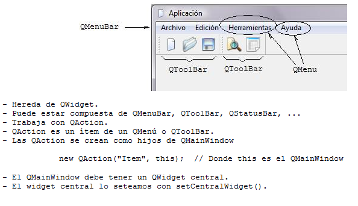
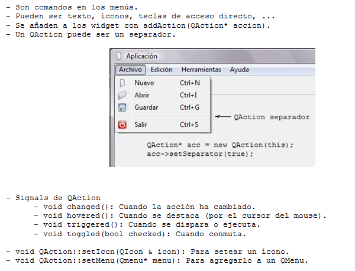
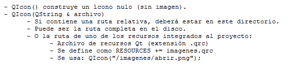

.. -*- coding: utf-8 -*-

.. _rcs_subversion:

Clase 12 - PGE 2022
===================
(Fecha: 22 de septiembre)

Registro en video de algunos temas de la clase de hoy
^^^^^^^^^^^^^^^^^^^^^^^^^^^^^^^^^^^^^^^^^^^^^^^^^^^^^

`Explicación de QMainWindow 2020 <https://youtu.be/ldxQrBTjio0>`_

`Creación de una interfaz con QMainWindow 2020 <https://youtu.be/fNS2Wyf-PaY>`_

QMainWindow
===========

**QAction**

**QIcon**

:Buscar íconos aquí: http://findicons.com/ 

:También aquí: https://boxicons.com/

Uso de una clase propia con QtDesigner
======================================

- Deben heredar de algún QWidget
- Colocamos el widget (clase base) con QtDesigner
- Clic derecho "Promote to"

.. figure:: images/qtdesigner.png
                     
- Base class name: QLabel
- Promoted class name: MiLabel
- Header file: miLabel.h
- Add (y con esto queda disponible para promover)

- La clase MiLabel deberá heredar de QLabel
- El constructor debe tener como parámetro:

.. code-block:: c++

    MiLabel( QWidget * parent = 0 );  // Esto en miLabel.h

    MiLabel::MiLabel( QWidget * parent ) : QLabel( parent )  {  // Esto en miLabel.cpp
    
    }

Ejercicio 1
===========

- Crear un Qt Widgets Application con QMainWindow
- Crear un editor de código fuente (como el NotePad++ o el Sublime Text).
- Utilice un buen paquete de íconos.
- Que tenga las funcionalidades más comunes de los editores de texto.

Ejercicio 2
===========

- Incorporar el editor de código del ejercicio anterior un Login
- Que el Login sea independiente
- El campo para el usuario del Login tiene que ser la clase LineaDeTexto, que tiene incorporado el mecanismo de recomendaciones
- Para las recomendaciones que se vaya generando una lista que vaya incorporando cada numbre de usuario que se use

Trabajos prácticos varios
=========================

- En la siguiente carpeta se comparten distintos trabajos prácticos que pueden servir para definir proyectos finales y realizar prácticas 
- `Carpeta de Google Drive con trabajos prácticos <https://drive.google.com/drive/folders/1m9v_d4HogNg_pRUnYKiu05nGDMfGDThH?usp=sharing>`_

