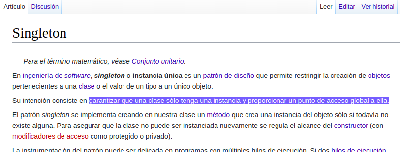

.. -*- coding: utf-8 -*-

.. _rcs_subversion:

Clase 13 - PGE 2021
===================
(Fecha: 23 de septiembre)

Uso de singleton
================

Ejemplo de AdminDB como singleton
=================================

.. code-block:: c++

	#ifndef ADMINDB_H
	#define ADMINDB_H

	class AdminDB  {

	private:
	    static AdminDB * instancia;
	    AdminDB();

	public:
	    static AdminDB * getInstancia();

	    void conectar();
	};

	#endif // ADMINDB_H

.. code-block:: c++

	#include "admindb.h"
	#include <QDebug>

	AdminDB * AdminDB::instancia = nullptr;

	AdminDB::AdminDB()  {
	}

	AdminDB * AdminDB::getInstancia()  {
	    if( instancia == nullptr )  {
	        instancia = new AdminDB;
	    }
	    return instancia;
	}

	void AdminDB::conectar()  {
	    qDebug() << "La base se encuentra conectada...";
	}

.. code-block:: c++

	#include "admindb.h"

	int main( int, char ** )  {

	    AdminDB::getInstancia()->conectar();

	    return 0;
	}

Ejemplo de un Login independiente
=================================

.. code-block:: c++

	#include <QApplication>
	#include "manager.h"

	int main( int argc, char ** argv )
	{
	    QApplication a( argc, argv );

	    Manager manager;
	    manager.iniciar();

	    return a.exec();
	}

.. code-block:: c++

	#ifndef MANAGER_H
	#define MANAGER_H

	#include <QObject>
	#include <QVector>

	#include "login.h"
	#include "formulario.h"

	class Manager : public QObject
	{
	    Q_OBJECT
	public:
	    explicit Manager( QObject * parent = 0 );

	    void iniciar();

	private:
	    Login * login;
	    Formulario * formulario;

	private slots:
	    void slot_ingreso( bool valido, QStringList usuario );

	};

	#endif // MANAGER_H

.. code-block:: c++

	#include "manager.h"

	Manager::Manager( QObject * parent ) : QObject( parent ),
	                                       login( new Login ),
	                                       formulario( new Formulario )
	{

	    connect( login, SIGNAL( signal_usuarioValidado( bool, QStringList ) ), 
	             this, SLOT( slot_ingreso( bool, QStringList ) ) );

	    QVector< QStringList > nuevosUsuarios;

	    QStringList usuario1;  usuario1 << "carlos" << "123";
	    QStringList usuario2;  usuario2 << "miguel" << "1234";
	    QStringList usuario3;  usuario3 << "julio" << "12345";

	    nuevosUsuarios << usuario1 << usuario2 << usuario3;

	    login->setBaseUsuarios( nuevosUsuarios );
	}

	void Manager::iniciar()
	{
	    login->show();
	}

	void Manager::slot_ingreso( bool valido, QStringList usuario )
	{
	    if ( valido )  {
	        login->hide();
	        formulario->show();
	        formulario->setWindowTitle( "Bienvenido: " + usuario.at( 0 ) );
	    }
	    else  {
	        login->close();
	    }
	}

.. code-block:: c++

	#ifndef LOGIN_H
	#define LOGIN_H

	#include <QWidget>
	#include <QVector>
	#include <QStringList>

	namespace Ui {
	    class Login;
	}

	class Login : public QWidget
	{
	    Q_OBJECT

	public:
	    explicit Login( QWidget * parent = 0 );
	    ~Login();

	    /**
	     * @brief setBaseUsuarios Permite agregar usuarios permitidos para 
	              este login. Siempre estara el usuario admin:nimda
	     * @param usuarios Son los nuevos usuarios que se agregan a 
	              este login sin borrar los anteriores.
	     */
	    void setBaseUsuarios( QVector< QStringList > usuarios );

	private:
	    Ui::Login *ui;

	    /**
	     * @brief usuarios Se mantienen todos los usuarios validos para este login. 
	              El QStringList almacena las credenciales usuario:clave
	     */
	    QVector< QStringList > usuarios;

	private slots:
	    void slot_validarUsuario();

	signals:

	    /**
	     * @brief signal_usuarioValidado Se emite cuando un usuario intenta ingresar.
	     * @param valido Si es true entonces el usuario es valido, sino devuelve false.
	     * @param usuario Son las credenciales que el usuario ingresa.
	     */
	    void signal_usuarioValidado( bool valido, QStringList usuario );
	};

	#endif // LOGIN_H

.. code-block:: c++

	#include "login.h"
	#include "ui_login.h"

	Login::Login( QWidget * parent ) : QWidget( parent ),
	                                   ui( new Ui::Login )
	{
	    ui->setupUi( this );

	    QStringList usuarioAdmin;
	    usuarioAdmin << "admin" << "nimda";

	    usuarios << usuarioAdmin;

	    connect( ui->pbIngresar, SIGNAL( pressed() ), this, SLOT( slot_validarUsuario() ) );
	    connect( ui->leClave, SIGNAL( returnPressed() ), this, SLOT( slot_validarUsuario() ) );
	}

	Login::~Login()
	{
	    delete ui;
	}

	void Login::setBaseUsuarios( QVector< QStringList > usuarios )
	{
	    this->usuarios << usuarios;
	}

	void Login::slot_validarUsuario()
	{
	    QStringList usuarioIngresado;
	    usuarioIngresado << ui->leUsuario->text() << ui->leClave->text();

	    if ( this->usuarios.contains( usuarioIngresado ) )
	        emit signal_usuarioValidado( true, usuarioIngresado );
	    else
	        emit signal_usuarioValidado( false, usuarioIngresado );
	}

.. code-block:: c++

	#ifndef FORMULARIO_H
	#define FORMULARIO_H

	#include <QWidget>

	namespace Ui {
	    class Formulario;
	}

	class Formulario : public QWidget
	{
	    Q_OBJECT

	public:
	    explicit Formulario( QWidget * parent = 0 );
	    ~Formulario();

	private:
	    Ui::Formulario *ui;
	};

	#endif // FORMULARIO_H

.. code-block:: c++

	#include "formulario.h"
	#include "ui_formulario.h"

	Formulario::Formulario( QWidget * parent ) : QWidget( parent ),
	                                             ui( new Ui::Formulario )
	{
	    ui->setupUi( this );
	}

	Formulario::~Formulario()
	{
	    delete ui;
	}

Preparándonos para el parcial:
==============================

- Tener bien preparada la clase AdminDB como singleton y con los métodos adecueados para actuar con una base SQLite.
- Sobrecarga de operadores
- Templates
- Contructores copia y operador de asignación

Ejercicio 1
===========

- Modificar el ejemplo anterior para que Manager, Login y Formulario sean singletons.
- Definir una clase Ventana que tenga una imagen de background, que Ventana sea singleton y agregarle objetos Boton para distintas acciones.
- Definir estas clases independientes para luego controlarlas a través de un Manager.

Desafío para el jueves 29 de septiembre
=======================================

`Clase LineaDeTexto <https://youtu.be/RKhyrwU8Lag>`_ - Código `aquí <https://github.com/cosimani/Curso-PGE-2021/blob/main/desafios/LineaDeTexto.rar?raw=true>`_

