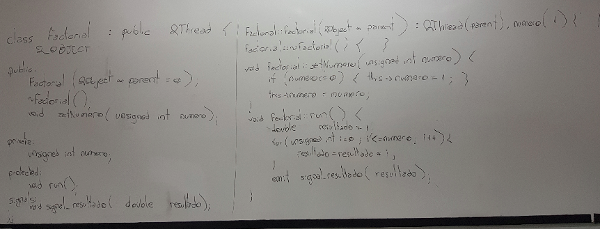
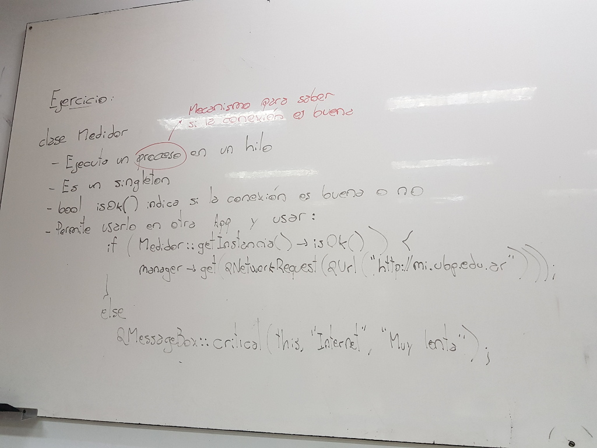

.. -*- coding: utf-8 -*-

.. _rcs_subversion:

Clase 14 - PGE 2022
===================
(Fecha: 29 de septiembre)

Clase QThread
============

- Permite crear hilos de ejecución para realizar varias tareas a la vez. 
- Proporciona el método start() para iniciar el hilo.
- Emite señales para indicar el inicio y fin de la ejecución del hilo.
- Se necesita reimplementar el método run() en una clase derivada de QThread.
- El código dentro de run() se ejecuta en un hilo y finaliza cuando retorna.
- La programación multihilo es útil para realizar tareas que consumen tiempo sin congelar la interfaz de usuario.

.. code-block:: c++

	class MiHilo : public QThread  {
	    Q_OBJECT

	protected:
	    void run();
	};

	void MiHIlo::run()  {

	    ...

	}

	
- Las clases no GUI (QTimer, QTcpSocket, QFtp, etc.) fueron diseñadas para funcionar en un hilo independiente.
- Las clases GUI (QWidget y derivadas) sólo se puede usar desde el hilo principal.
- Para consultar el estado del hilo podemos utilizar isFinished() o isRunning().
- Podríamos terminar un hilo a fuerza bruta con terminate().
- Dormimos el hilo con: ``sleep(int seg)`` o ``msleep0(int miliseg)`` o ``usleep(int microseg)``

Ejemplo: Clase Factorial
========================

Ejercicio 1:
============
	
- Diseñar una aplicación GUI que escriba en un archivo muchísimos caracteres de tal forma se note que la interfaz de usuario se bloquea hasta finalizar la escritura.
- Luego de esto, utilizar un hilo distinto para escribir la misma cantidad de caracteres.

Ejercicio 2:
============

