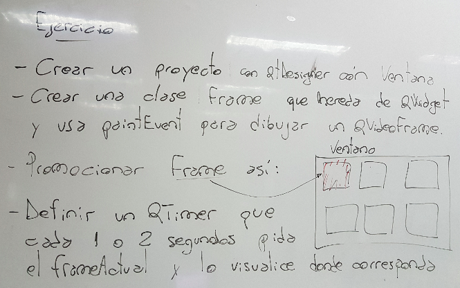

.. -*- coding: utf-8 -*-

.. _rcs_subversion:

Clase 23 - PGE 2022
===================
(Fecha: 3 de noviembre)

Registro en video de algunos temas de la clase de hoy
^^^^^^^^^^^^^^^^^^^^^^^^^^^^^^^^^^^^^^^^^^^^^^^^^^^^^

`QAbstractVideoSurface 2021 <https://youtu.be/A00-6YP8azM>`_


Levantar frame por frame: Clase QAbstractVideoSurface
=====================================================

- QAbstractVideoSurface es una clase abstracta
- Proporciona streaming de video a través de la función virtual pura present()

.. code-block:: c++

	bool QAbstractVideoSurface::present ( const QVideoFrame & frame ) [pure virtual]


**Clase Capturador para obtener los frames de la cámara**

.. code-block:: c++

	class Capturador : public QAbstractVideoSurface  {
	    Q_OBJECT

	public:
	    Capturador( QObject * parent = 0 );

	    QList< QVideoFrame::PixelFormat > supportedPixelFormats(
	          QAbstractVideoBuffer::HandleType handleType = QAbstractVideoBuffer::NoHandle ) const;

	    bool present( const QVideoFrame & frame );

	    QVideoFrame getFrameActual()  {  return frameActual;  }

	private:
	    QVideoFrame frameActual;
	};


- QVideoFrame encapsula los datos de video (bits, ancho, alto, etc.)
- Para acceder a los bits es necesario mapearlo con el método map()
- El mapeo deja en memoria los datos para se accedidos.

.. code-block:: c++

	bool Capturador::present( const QVideoFrame & frame )  {
	    frameActual = frame;
		
	    frameActual.map( QAbstractVideoBuffer::ReadOnly );
		
	    return true;  // Con la idea de devolver true si este frame fue usado
	}


- La función virtual pura supportedPixelFormats() devuelve un listado de formatos soportados.

.. code-block:: c++

	QList< QVideoFrame::PixelFormat > Capturador::supportedPixelFormats(
	                         QAbstractVideoBuffer::HandleType handleType ) const  {
	
	    if ( handleType == QAbstractVideoBuffer::NoHandle ) {
	        return QList< QVideoFrame::PixelFormat >()
	                                                  << QVideoFrame::Format_RGB32
	                                                  << QVideoFrame::Format_ARGB32;
	    }
	    else {
	        return QList< QVideoFrame::PixelFormat >();
	    }
	}

**El constructor**

.. code-block:: c++

	Capturador::Capturador( QObject * parent ) : QAbstractVideoSurface( parent )  {

	}

Ejercicio 1:
==========

- Usar Capturador para levantar las imágenes de la cámara.
- Convertir a escala de grises y visualizarlo en pantalla.


Ejercicio 2:
==========



- En esa grilla de 6 celdas, todas esas celdas son objetos Frame.
- 5 de ellos serán imágenes fijas cargadas desde el disco duro.
- La restante serán las imágenes obtenidas en tiempo real desde la cámara.
- La clase Frame tendrá un método ``modo`` que recibe una enumeración con dos opciones ``IMAGEN_FIJA`` o ``CAMARA```.

