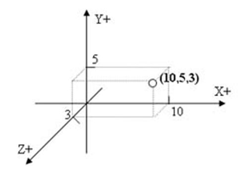

.. -*- coding: utf-8 -*-

.. _rcs_subversion:

Clase 24 - PGE 2022
===================
(Fecha: 8 de noviembre)

Registro en video de algunos temas de la clase de hoy
^^^^^^^^^^^^^^^^^^^^^^^^^^^^^^^^^^^^^^^^^^^^^^^^^^^^^

`OpenGL 2022 <https://youtu.be/o5J5zm7UAbU>`_

Código fuente en relación a la clase de hoy
^^^^^^^^^^^^^^^^^^^^^^^^^^^^^^^^^^^^^^^^^^^

`Primer programa con OpenGL <https://github.com/cosimani/Curso-PGE-2022/blob/main/recursos/opengl_8nov2022.rar?raw=true>`_

Graficación 3D
==============

OpenGL
^^^^^^

- Open Graphics Library
- Especificación que define una API para dibujar en 2D y 3D.
- Los fabricantes de Hardware se basan en esta especificación.
- Funciones para dibujar escenas complejas desde primitivas geométricas.
- Primitivas geométricas simples: Puntos, líneas y triángulos.
- Desarrollada por Silicon Graphics Inc. (1992).
- En 2006 pasa al Grupo Khronos
- Compite con Direct3D de Microsoft
- Direct3D, DirectShow, DirectSound, DirectPlay y otras, son parte de DirectX.

**Para tener en cuenta**

- Las funciones de OpenGL comienzan con ``gl`` y las constantes con ``GL_``
- Existe un sufijo que indica la cantidad de parámetros y el tipo

.. code-block:: c	

	glVertex3f  // 3 parámetros del tipo float

- OpenGL define sus tipos de datos (con ``typedef``)

.. code-block:: c	

	// (typedef se utiliza para asignar un alias a un tipo)

	typedef int GLint
	typedef float GLfloat	

	// s Entero 16-bits short            GLshort
	// i Entero 32-bits int              GLint
	// f Punto flotante 32-bits float    GLfloat
	// d Punto flotante 64-bits double   GLdouble

**Algunos datos**

- 24 cuadros por segundo notamos es la mínima para percibirlo en movimiento fluido.
- Mayor cantidad de imágenes se verá mejor aún.
- 24 fps y 48 fps se utiliza en el cine.
- 60 fps para televisión de alta definición.
- 90 fps se utilizan para realidad virtual.
- Consolas de juegos, algunos monitores ya usan 144 fps.
- Hay bibliotecas que aportan más funcionalidades: GLU, GLUT, GLEW, etc.
- Las primitivas se componen de vértices (puntos en 3D).
- Perspectiva ortonormal: 
 
.. figure:: images/ortonormal.png

- Punto en 3D. 

.. code-block:: c	

	glVertex3f( 10.0f, 5.0f, 3.0f );

Dibujando primitivas
^^^^^^^^^^^^^^^^^^^^

**Puntos GL_POINTS**

.. code-block:: c

	glBegin( GL_POINTS );
	    glVertex3f( 0.0f, 0.0f, 0.0f );
	    glVertex3f( 10.0f, 10.0f, 10.0f );
	glEnd();

- Comienza indicando el tipo de primitiva con ``glBegin()``.
- ``glBegin()`` y ``glEnd()`` actúan como llaves, por ello se acomoda de esa forma.
- Un punto por defecto tiene 1 píxel por 1 píxel
- Podemos setear su tamaño:

.. code-block:: c

	glPointSize( 6.0f ); // tamaño del pixel = 6

**Líneas GL_LINES**

.. code-block:: c

	GLfloat angulo;
	int i;

	glBegin( GL_LINES );
	for ( i = 0; i < 360; i+=3 )  {
	    angulo = ( GLfloat )i * 3.14159f / 180.0f; // grados a radianes
	    glVertex3f( 0.0f, 0.0f, 0.0f );
	    glVertex3f( cos( angulo ), sin( angulo ), 0.0f );
	}
	glEnd();

- Dos puntos hacen una recta.
- Con un número impar de puntos, el último se ignora.

**Líneas consecutivas GL_LINE_STRIP**

- El primer punto y el segundo forman una línea.
- El tercer punto forma una línea con el segundo y así sucesivamente.

**Triángulos GL_TRIANGLES**

.. code-block:: c

	glBegin( GL_TRIANGLES );
	    glVertex3f( 0, -1.0f, -0.5f );
	    glVertex3f( 1.0f, -0.9f, -0.5f );
	    glVertex3f( 0.0f, -0.5f, -0.5f );
	glEnd();

**Color de relleno**

- Modificamos el color con ``glColor3f()`` con valores de 0 a 1.

.. code-block:: c

	glBegin( GL_TRIANGLES );
	    glColor3f( 0, 0, 1 );
	    glVertex3f( 0, -1.0f, -0.5f );
	    glVertex3f( 1.0f, -0.9f, -0.5f );
	    glVertex3f( 0.0f, -0.5f, -0.5f );
	glEnd();

Uso de la Clase QGLWidget
^^^^^^^^^^^^^^^^^^^^^^^^^

- Se requiere lo siguiente en el .pro

.. code-block:: c

	QT += opengl

	win32:LIBS += -lopengl32
	win32:LIBS += -lglu32
	
	unix:LIBS += -lGLU

.. code-block:: c

	#include <QGLWidget>

	class MiOpenGL : public QGLWidget  {
	    Q_OBJECT
		
	public:
	    MiOpenGL();

	protected:
	    void initializeGL();	
	    void resizeGL( int w, int h );
	    void paintGL();
	};
	
	MiOpenGL::MiOpenGL()  {
	
	}

	void MiOpenGL::initializeGL()  { 
	    glClearColor( 0, 0, 0, 0 );
	}

	void MiOpenGL::resizeGL( int w, int h )  {
	    // Porción de ventana donde puede dibujar.
	    glViewport( 0, 0, w, h );

	    // Especifica la matriz actual: matriz de proyección (GL_PROJECTION), matriz de modelo
	    // (GL_MODELVIEW) y matriz de textura (GL_TEXTURE). 
	    glMatrixMode( GL_PROJECTION );

	    // Con esto cargamos en el "tipo" de matriz actual (matriz identidad - como resetear).
	    // Es una matriz 4x4 llena de ceros salvo la diagonal que contiene unos. 
	    glLoadIdentity();

	    // Para delimitar la zona de trabajo en una caja.
	    glOrtho( -1, 1, -1, 1, -1, 1 );

	    // Se vuelve a este tipo de matrices, que afecta a las primitivas geométricas.
	    glMatrixMode( GL_MODELVIEW );
	}

	void MiOpenGL::paintGL()  {
	    // Borra un buffer.
	    glClear( GL_COLOR_BUFFER_BIT );

	    //  Carga la matriz identidad.
	    glLoadIdentity();

	    // Acá se inserta el código para dibujar 

	    // Volcamos en pantalla lo que se creó en memoria.
	    glFlush();
	}

**Ejercicio 1**

- Dibujar un triángulo en el plano ``z=-50``
- Utilizar el teclado para que al presionar la tecla C, el triángulo cambie de color.

