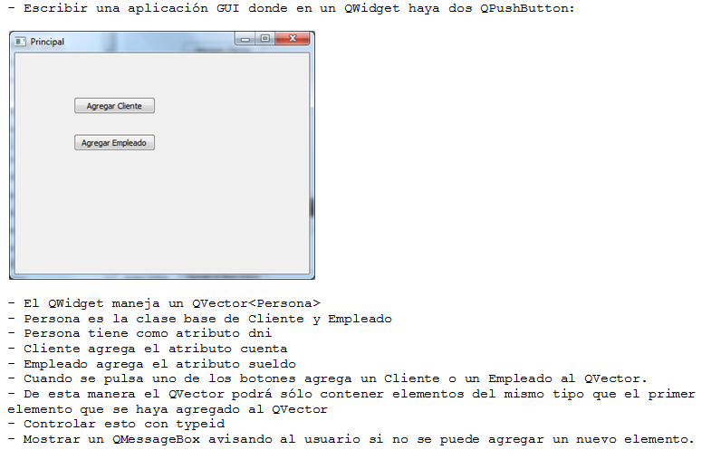

.. -*- coding: utf-8 -*-

.. _rcs_subversion:

Ejercicios para PGE
===================

Ejercicio 1
===========

- Punto de partida: Other Project -> Empty qmake Project
- Copiar y pegar este código de la clase Listado en un archivo de cabecera listado.h
- Se recomienda que la definición de clases genéricas se realice en un único archivo .h (no usar el .cpp)
- Dentro de la función main en el archivo main.cpp instanciar un objeto Listado que contenga int
- Agregar 5 datos del tipo int en ese objeto Listado
- Recorrerlo con un for mostrando en consola estos 5 valores

Ejercicio 2
===========

- Utilizar el código fuente de la clase Listado.
- Agregar el siguiente método para eliminar el elemento de la posición i.

.. code-block:: c

	void erase( int i )

- Agregar el método que elimine un elemento del final.

.. code-block:: c
	
	void pop_back()

Ejercicio 3
===========

- Agregar los siguientes dos métodos: ``borrar_del_final( int cuantos )`` y ``borrar_del_principio( int cuantos )``. 
- Tener en cuenta que tenemos ya definidos métodos que borran elementos, entonces, utilizarlos para ahorrar tiempo de desarrollo.
- En la función main crear un ``Listado< str::string >`` y agregar 8 cadenas
- Borrar 2 elementos del final y borrar 2 elementos del principio
- Recorrer el Listado con un for y mostrar los elementos que quedan

Ejercicio 4
===========

- Utilizar el código fuente del proyecto en el cual se creó la clase Poste.
- Definir estos nuevos operadores en la clase Poste: ``float operator+( Poste poste )`` y ``Poste operator+( float altura )``.
- El primer operador suma la altura de los dos Postes y devuelve la altura total.
- El segundo operador le suma una altura particular a un Poste y devuelve un nuevo Poste con esa altura sumada.
- En la función main probar estos operadores.

Ejercicio 5
===========

- Definir una clase genérica Listado que herede de std::vector.
- Agregar un método que permita agregar varias veces un elemento al vector. El método es el siguiente: ``void agregarElementos( T elemento, int cantidad )``
- Sobrecargar el operator+ que permita unir dos objetos de la clase Listado y que devuelva un nuevo objeto con todos los elementos unidos.
- Sobrecargar el operator- que reciba como parámetro un int para indicar la cantidad de elementos que debe borrar del principio. En caso que el listado contenga menos elementos de los que se desean borrar, entonces deberá quedar vacío.
- Escribir todos los métodos de la clase Listado de manera off-line.
- Probar la funcionalidad de Listado en la función main() de la siguiente forma:
	- Crear un objeto Listado 
	- Agregar 10 elementos con el método agregarElementos
	- Publicar por consola todos los elementos de este objeto
	- Crear otro objeto Listado y agregar 5 elementos.
	- Usar el operador + para unirlos y publicar todos los elementos del objeto resultante.
	- Usar también el operador -

Ejercicio 6
===========

- Definir una clase Enteros que gestione una pila de enteros. Hereda de QVector de int. Aclaración: Enteros no es una clase genérica.
- El único método que permite agregar elementos a Enteros es el siguiente: ``void agregarElemento( int elemento )``
- Todos los otros métodos que permiten agregar elementos ( tal como: push_back, insert, etc. ) deberán tener acceso privado para no poder ser utilizados. Directamente no compilará cuando se intenten utilizar. Enteros no podrá almacenar más de 10 elementos. Es decir, podemos utilizar muchas veces agregarElemento( int ) pero no agregará más de 10 elementos. Inicialmente Enteros no tiene elementos. 
- Sobrecargar el operator+ que permita unir dos objetos de la clase Enteros y que devuelva un nuevo objeto con todos los elementos unidos.
- Probar la funcionalidad de Enteros en la función main() de la siguiente forma:
	- Crear un objeto Enteros
	- Intentar agregar 15 elementos con el método agregarElemento
	- Publicar por consola todos los elementos de este objeto
	- Crear otro objeto Enteros y agregar 3 elementos.
	- Usar el operador + para unirlos y publicar todos los elementos del objeto resultante.

Ejercicio 7
===========

- Definir una clase clásica Colectivo que herede de std::vector< Persona >.
- Definir una clase Persona
	- Los atributos de Persona son: int edad, QString nombre, QImage * fotoPerfil
	- Agregar los getters and setters.
	- Notar que fotoPerfil es un puntero.
	- El setter de fotoPerfil que reciba un QString con la ruta a la imagen en disco
- Definir en la clase Persona su constructor copia y operador de asignación explícitos que realicen una buena copia, es decir, que atiendan correctamente es puntero para la fotoPerfil
- Sobrecargar el operator++ en Persona que permita incrementar su edad en 1.
- Sobrecargar el operator- en Colectivo que permita extraer la última Persona agregada al Colectivo. Tener en cuenta que este operador deberá devolver un objeto Persona.
- Probar todas las funcionalidades posibles dentro de la función main().

Ejercicio 8
===========

- Definir una clase clásica Camion que herede de QVector< Tronco >.
- Definir una clase Tronco con su constructor copia y operador de asignación explícitos. 
	- Los atributos de Tronco son: float altura, QString nombreAserradero.
	- Agregar los getters and setters.
- Sobrecargar el operator++ en Tronco que permita incrementar en 5 su altura.
- Sobrecargar el operator- en Camion que permita extraer el último Tronco agregado al Camion. Tener en cuenta que este operador deberá devolver un objeto Tronco.
- Sobrecargar el operator+ en Camion que reciba como parámetro un Tronco y agregue al Camion al principio. Este operador deberá devolver void.
- Probar todas las funcionalidades posibles dentro de la función main().

Ejercicio 9
===========

- Punto de partida: Utilizar el código fuente del proyecto de la clase Listado que tiene definido el ``operator+``.
- Sobrecargar el ``void operator+( int cuantasNuevasCeldas )`` de tal manera permita agregar nuevas celdas vacías al final del Listado. Este operador no deberá modificar el contenido que ya tenga el Listado.
- También completar el código con las definiciones de los métodos ``clear``, ``pop_back``, ``erase`` e ``insert`` que ya hemos trabajado anteriormente.
- En la función main crear un ``Listado< QString >`` para 5 elementos como máximo y agregar 3 cadenas.
- Utilizar el operador definido en este entregable para aumentar a 10 la cantidad de celdas disponibles.
- Agregar 3 nuevas celdas y completar con QString todas las celdas disponibles.

Ejercicio 10
============

- Crear una clase genérica SuperListado que herede de QVector
- Que tenga las mismas características que la clase Listado del ejercicio anterior.

Ejercicio 11
============

- Crear una clase Persona simple.
- Sobrecargar en Persona el ``operator++`` de tal manera permita incrementar en uno su edad.
- Que puda funcionar algo así:

.. code-block:: c

	Persona carlos( 20, "Carlos" );
	carlos++;
	qDebug() << carlos.getEdad();  // Esto debe devolver 21

Ejercicio 12
============

- Crear un QVector< QWidget > y agregar 3 objetos.
- Trabajar directamente en la función ``main``
- ¿Puede compilarlo?
- Tratar de solucionarlo.

Ejercicio 13
============

- Crear una clase Ventana que herede de QWidget.
- Crear un QVector< Ventana > y agregar 3 objetos.
- Tener en cuenta que no son punteros, sino objetos concretos de QWidget.
- Elegir un par de características más para copiar.
- Usar un for para extraerlos y mostrarlos como ventanas independientes.

Ejercicio 14
============

- Mencionar y usar todos los métodos estáticos que hemos visto en POO y PGE hasta ahora.
- Por ejemplo, el ``QString::number( int )``
- Trabajar entre estudiantes porque hay que recordarlos a todos y cada uno de ellos, quizás revisando la clases en GitHub.
- El desafío está en no olvidarse ninguno.
- Realizar un ejemplo de cada uno (puede ser en el mismo proyecto de Qt).

Ejercicio 15
============

- Utilizar la clase Poste para sobrecargar operator+ para que sume un objeto Poste con un int.

- Esa sobrecarga nos permitirá hacer ``Poste suma = p1 + 5;``

- Qué pasa si queremos		 ``Poste suma = 5 + p1;``

- Proponer una solución.

Ejercicio 16
============

- Modificar el ejemplo de la imagen rotando y detectar click derecho para cambiar el sentido de rotación.

Ejercicio 17
============

- Definir una clase genérica ``MiVector`` que herede de ``QVector< T >`` y que permita ordenar de menor a mayor cualquier elemento.
- Considere que para ordenar de menor a mayor algún elemento se necesitará comparar un elemento con otro.
- Por lo tanto, si deseamos que ``MiVector`` pueda contener elementos de cualquier tipo, y además deseamos ordenarlos, entonces estos elementos deberan cumplir la caraccterística de ser "comparables". Esto es muy familiar cuando se trabaja en Java.
- Definir clases comparables eligiendo la/las característica/s que permitan comparar dichos objetos entre ellos.
- Entre las clases que se pueden definir como comparables están: ``Persona``, ``Poste``, ``Cliente``, ...
- Agregar un método en la clase genérica ``MiVector`` que ordene los elementos. Que el método sea ``void ordenar_de_mayor_a_menor();``
- Probar el funcionamiento del ordenamiento utilizando ``MiVector< Persona >``, ``MiVector< Poste >``, ``MiVector< int >``.
- Mostrar los resultados en un ``QTextEdit`` en lugar de visualizarlo directamente por consola.

Ejercicio 18
============

- ¿Qué pasaría con el ordenamiento si se utilizan punteros como elementos, por ejemplo, ``MiVector< Persona * >``, ``MiVector< Poste * >``.
- Adaptar para que el ordenamiento se pueda realizar utilizando punteros. Proponer una solución a esto. 

Ejercicio 19
============

- Utilizar una clase Login creada anteriormente (o crear una nueva) para generar una librería dinámica .dll (en Windows) o .so (en Linux o Mac).
- Login deberá tener caracaterísticas de ser una clase independiente, es decir, que se pueda utilizar en cualquier proyecto sin necesidad de modificarla.

Ejercicio 20
============

- Desarrollar la clase LineaDeTexto para hacer funcionar la siguiente función ``main()``
- Notar que la línea ``linea.show();`` deberá mostrar un QLineEdit con el texto 'Hola che'

.. code-block:: c
	
	#include <QApplication>
	#include "lineadetexto.h"

	int main( int argc, char ** argv )  {
	    QApplication a( argc, argv );

	    LineaDeTexto linea;

	    {
	        LineaDeTexto l1 = "Hola";
	        LineaDeTexto l2 = "che";

	        linea = l1 + l2;
	    }

	    linea.show();  // Esta línea mostrará un QLineEdit con el texto 'Hola che'

	    return a.exec();
	}

Ejercicio 21
============

- Adaptar esta característica de recomendaciones en una clase LineaDeTexto que hereda de QLineEdit

Ejercicio 22
============

- Diseñar una interfaz inspirada en la siguiente:

Ejercicio 23
============

- Diseñar otra interfaz inspirada en la siguiente:

.. figure:: images/interfaz_ejemplo.jpg

Ejercicio 24
============

- Crear un Qt Widgets Application con QMainWindow
- Crear un editor de código fuente (como el NotePad++ o el Sublime Text).
- Utilice un buen paquete de íconos.
- Que tenga las funcionalidades más comunes de los editores de texto.
- `Avances realizados en clases <https://drive.google.com/drive/folders/1XVZZ_CbSNYzjz3LIQbBJ0Y6kpCs44JNi?usp=sharing>`_

Ejercicio 25
============

- Incorporar el editor de código del ejercicio anterior un Login
- Que el Login sea independiente
- El campo para el usuario del Login tiene que ser la clase LineaDeTexto, que tiene incorporado el mecanismo de recomendaciones
- Para las recomendaciones que se vaya generando una lista que vaya incorporando cada numbre de usuario que se use

Ejercicio 26
============

- `Avances realizados en clases <https://drive.google.com/drive/folders/1XVZZ_CbSNYzjz3LIQbBJ0Y6kpCs44JNi?usp=sharing>`_
- Modificar el ejemplo anterior para que Manager, Login y Formulario sean singletons.
- Definir una clase Ventana que tenga una imagen de background, que Ventana sea singleton y agregarle objetos Boton para distintas acciones.
- Definir estas clases independientes para luego controlarlas a través de un Manager.

Ejercicio 27
============

- Implementar la clase Factorial en una aplicación
- Crear una GUI que solicite el número para calcular el factorial.
- La interfaz no se debe colgar/tildar.

Ejercicio 28
============

	
- Diseñar una aplicación GUI que escriba en un archivo muchísimos caracteres de tal forma se note que la interfaz de usuario se bloquea hasta finalizar la escritura.
- Luego de esto, utilizar un hilo distinto para escribir la misma cantidad de caracteres.

Ejercicio 29
============

- Diseñar una clase Medidor que sirva para saber si la conexión a internet es buena
- Es un singleton
- ``bool isOk();`` indica si la conexión es buena o no.
- Debe ser una clase independiente
- La instancia de esta clase permitirá hacer lo siguiente:

.. code-block:: c++

	if ( Medidor::getInstancia()->isOk() )  {
	    manager->get( QNetworkRequest( QUrl( "http://mi.ubp.edu.ar" ) ) );
	} 
	else  {
	    QMesaggeBox::critical( this, "Internet", "Muy lenta" );
	}

Ejercicio 30
============

- Diseño de GUI pensando en smart phone
- Usar fuentes propias. ``QFontDatabase::addApplicationFont( ":/resources/fuentes/angelina.ttf" );``
- Diseñar un interfaz con botones propios que usen estas fuentes.

Ejercicio 31
============

- Pensar en el diseño de una API propia para validar usuarios
- Disponer de un servidor con PHP y MySQL para tener la base de datos con una tabla para usuarios
- Escribir un script para validar los usuarios en esa API
- Desarrollar un Login independiente que use un ``QNetworkAccessManager`` para validar contra la API

Ejercicio 32
============

Ejercicio 33
============

- Demostrar de alguna manera si ``type_info`` tiene el constructor copia público o privado.
- Luego revisar el archivo de cabecera de ``type_info`` para corroborar.
- Como ayuda el siguiente código:

.. code-block:: c++

	void funcion( std::type_info info )  {
	    qDebug() << info.name();
	}

	int main( int argc, char ** argv )  {
	    QApplication a( argc, argv );

	    const std::type_info & ref = typeid( int );
        qDebug() << ref.name();

	    return 0;
	}

Ejercicio 34
============

- Crear objetos comparables: Persona (sin herencia), Login (hereda de QWidget), Imagen (hereda de QImage)

Ejercicio 35
============

- AdminDB con todas las funcionalidades y singleton

Ejercicio 36
============

- Crear una clase Archivador, que sea singleton y permita almacenar Logs en un archivo de texto.

Ejercicio 37
============

- LineaDeTexto listo para promocionar y con dos opciones de sugerencias: desde Google o desde lista fija. 
- Que permita setear la segunda columna con el dato que se desee.

Ejercicio 38
============

- QMainWindow que tenga programado un método que reciba una enumeración en su constructor (SUBLIME, DARK, GALERIA, CLASSIC) que permita combinar (por ejemplo, DARK|SUBLIME o DARK|GALERIA)

Ejercicio 39
============

- Preparar instructivo de instalación de herramientas para el desarrollo en Android.
- Android Studio, NDK, JDK, Apache Ant, Qt Creator con Android.
- Explorar, instalar, probar, configurar, anotar las versiones que se instalan, compatibilidades entre versiones, anotar lo que se hace.

Ejercicio 40
============

- Definir la siguiente clase:

.. code-block:: c++

	class Ordenador  {
	public:
	    void burbuja( int * v, int n )  {  /* código */  }
	    void insercion( int * v, int n )  {  /* código */  }
	    void seleccion( int * v, int n )  {  /* código */  }
	};

- Esta clase tendrá distintos métodos de ordenamiento.
- Cada método ordena un array de n cantidad de enteros
- Definir la clase ListaDeEnteros
	- Herede de QVector
	- Que no sea un template
	- Que sólo mantenga elementos del tipo int
	- Definir un método:
	
.. code-block:: c++	
		
	void ordenar( void ( Ordenador::*puntero_funcion )( int * v, int n ) );
	// Este método ordenará los elementos

	
Ejercicio 41
============

- Con la misma idea del ejercicio anterior. Crear la clase genérica ListadoGenerico que herede de QVector<T>
- La clase ListaGenerico tendrá el siguiente método:
	
.. code-block:: c++	
		
	void ordenar( void ( Ordenador::*puntero_funcion )( T * v, int n ) )
	// Este método ordenará los elementos
	
- Notar que ordenar podrá ordenar elementos de cualquier tipo, siempre y cuando los objetos a ordenar sean de una clase que tenga sobrecargado el operador >

Ejercicio 42
============

- Con `este código fuente <https://github.com/cosimani/Curso-PGE-2022/blob/main/recursos/gui_botonera.rar?raw=true>`_ se genera la siguiente interfaz.

.. figure:: images/gui_botonera.png

- Abrir el proyecto gui_botonera y analizarlo.
- Modificar el comportamiento de los Block para que al hacer click se mantenga en verde durante 500 ms.

Ejercicio 43
============

- Modificar el ejercicio de la clase ListadoEnteros para usar funciones globales de ordenamiento, es decir, que no se encuentren dentro de Ordenador ni de ninguna clase.

.. code-block:: c++	

	class ListadoEnteros : public QVector<int>  {
	public:
	    void ordenar( void ( * pFuncionOrdenamiento )( int *, int ) )  {
	        ( *pFuncionOrdenamiento )( this->data(), this->size() );
	    }
	};

.. code-block:: c++		
	///// Desde main se puede utilizar así:

    void ( * ordenador )( int *, int ) = &burbuja;

    listado.ordenar( ordenador );

Ejercicio 44
============

- Modificar el ejercicio anterior usando también funciones globales de ordenamiento pero con la clase ListadoGenerico que sea un template:

.. code-block:: c++	

	template< class T > class ListadoGenerico : public QVector< T >  {
	public:
	    void ordenar( void ( * pFuncionOrdenamiento )( T *, int ) )  {
	        ( * pFuncionOrdenamiento )( this->data(), this->size() );
	    }
	};

Ejercicio 45
============

- Necesitamos conocer el rendimiento de cada algoritmo de ordenamiento midiendo su tiempo.
- Utilizar un array de punteros a funciones que apunte a cada función global de ordenamiento.
- Utilizar Archivador para almacenar los tiempos en un archivo.
- Utilizar un ListadoEnteros de 50.000 números generados con qrand()

.. code-block:: c++		

	///// Desde main se puede utilizar así:

    void ( * ordenador[ 2 ] )( int *, int );
    ordenador[ 0 ] = &burbuja;
    ordenador[ 1 ] = &insercion;

    listado.ordenar( ordenador[ 1 ] );

Ejercicio 46
============

- Analizar y hacer funcionar este ejemplo del callback con SIGNAL y SLOT

.. code-block:: c++

	#ifndef CONTADOR_H
	#define CONTADOR_H

	#include "ventana.h"
	#include <QDebug>
	#include <QThread>

	class Contador : public QThread  {

	public:
	    Contador() : contador( 0 ),
	                 hastaCuanto( 0 ),
	                 isRunning( false),
	                 puntero( nullptr ),
	                 ventana( nullptr )
	    {

	    }

	void setInterval( unsigned int hastaCuanto )  {
	    this->hastaCuanto = hastaCuanto;
	}

	void run()  {
	    if ( ! puntero || ! hastaCuanto )
	        return;

	    isRunning = true;

	    while( isRunning )  {
	        while ( contador < hastaCuanto )
	            contador-=-1;

	        contador = 0;
	        ( ventana->*puntero )();  // Esto es emitir la signal
	    }
	}

	void conectar( Ventana * ventana, void ( Ventana::*puntero )() )  {
	    this->puntero = puntero;
	    this->ventana = ventana;
	}

	void stop()  {
	    isRunning = false;
	}

	private:
	    unsigned int contador;
	    unsigned int hastaCuanto;
	    bool isRunning;
	    void ( Ventana::*puntero )();
	    Ventana * ventana;
	};

	#endif // CONTADOR_H

.. code-block:: c++

	#ifndef VENTANA_H
	#define VENTANA_H

	#include <QWidget>

	class Contador;

	class Ventana : public QWidget  {
	    Q_OBJECT

	public:
	    Ventana( QWidget * parent = nullptr );
	    ~Ventana();

	    void slot_sinSerSlot();

	private:
	    Contador * contador;
	};

	#endif // VENTANA_H

.. code-block:: c++

	#include "ventana.h"
	#include "contador.h"
	#include <QDebug>

	Ventana::Ventana( QWidget * parent ) : QWidget( parent ),
	                                       contador( new Contador )
	{
	    // Con setInterval se define hasta que numero debera contar 
	    // para realizar la retrollamada (o devolucion de llamada)
	    contador->setInterval( ( unsigned int )500000000 );

	    // Para conectar se puede definir un puntero a funcion y apuntarlo al metodo
	    //    void ( Ventana::*puntero )() = &Ventana::slot_sinSerSlot;
	    //    contador->conectar( this, puntero );

	    // O se puede apuntar al metodo sin declarar un puntero a funcion
	    contador->conectar( this, &Ventana::slot_sinSerSlot );

	    // También las siguientes expresiones son equivalentes:
	    //    connect( sender, SIGNAL( valueChanged( QString, QString ) ), 
	    //             receiver, SLOT( updateValue( QString ) ) );
	    //
	    //    connect( sender, &Sender::valueChanged, 
	    //             receiver, &Receiver::updateValue );

	    contador->start();
	}

	Ventana::~Ventana()  {
	    contador->stop();
	}

	void Ventana::slot_sinSerSlot()  {
	    qDebug() << "timeout";

	    // Tener en cuenta que Contador tiene un metodo stop para finalizar el contador
	    //    contador->stop();
	}

.. code-block:: c++

	#include "ventana.h"
	#include <QApplication>

	int main( int argc, char ** argv )  {
	    QApplication a( argc, argv );

	    Ventana w;
	    w.show();

	    return a.exec();
	}

Ejercicio 47
============

- Las expresiones equivalentes del tipo ``connect( sender, &Sender::valueChanged, receiver, &Receiver::updateValue );`` se pueden usar
- Modificar algún proyecto anterior para utilizar estas expresiones equivalentes.

Trabajos prácticos varios
=========================

- En la siguiente carpeta se comparten distintos trabajos prácticos que pueden servir para definir proyectos finales y realizar prácticas 
- Estos trabajos fueron propuestos para PGE en el año 2020
- `Carpeta de Google Drive con trabajos prácticos <https://drive.google.com/drive/folders/1m9v_d4HogNg_pRUnYKiu05nGDMfGDThH?usp=sharing>`_

